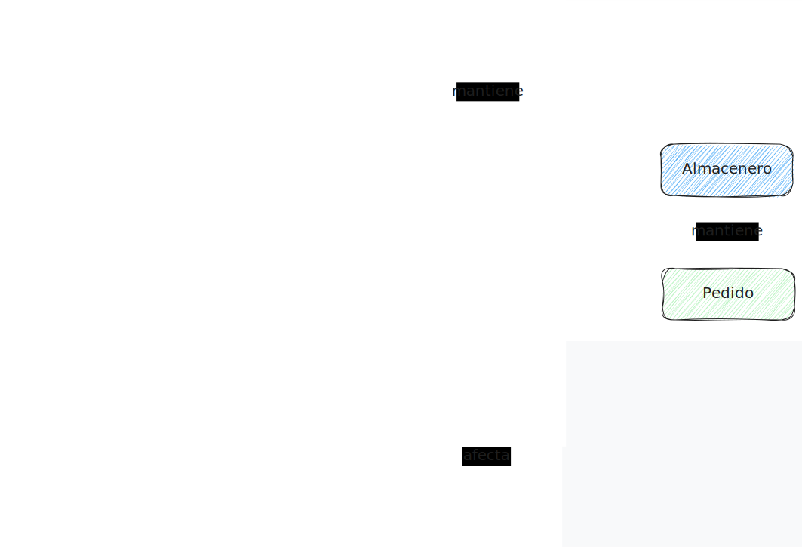

## 🧠 **ENTENDER EL DOMINIO**  
### _Building Block #1_


Objetivo
Construir el modelo mental del negocio antes de pensar en tecnología.

No se diseñan endpoints.
No se piensa en frameworks.
No se decide base de datos.

Solo se extrae la esencia del problema real que el sistema debe resolver.

### Objetivo
Construir el modelo mental del negocio antes de pensar en tecnología.

No se diseñan endpoints.
No se piensa en frameworks.
No se decide base de datos.

Solo se extrae la esencia del problema real que el sistema debe resolver.

📌 ¿Cuándo sabes que entendiste el dominio?

✔ Puedes explicarlo sin mencionar Express, Angular o Firestore.

✔ Hablas en términos del negocio, no del sistema.

✔ Las reglas existen aunque la app no exista.


<hr>

## 🔍 Preguntas clave del dominio (B2B)

Responde directamente desde los requisitos, no desde la solución técnica.

## 1️⃣ ¿Quiénes son los actores?

**Actores** = roles que interactúan con el sistema
No son tablas ni clases, son responsabilidades humanas o externas.

### Cliente
Empresa que realiza pedidos (no usuario individual)

### Almacenero
Prepara pedidos y gestiona estados operativos

### Conductor
Ejecuta la entrega física

### Administrador
Coordina, asigna rutas y supervisa

### Sistema de Pago
Servicio externo de validación (si aplica)


<hr>

## 2️⃣ ¿Qué cosas tienen identidad propia y persisten?

Entidades del dominio
Existen aunque la aplicación se caiga.

#### Producto
SKU, precio, variaciones, stock

### Pedido / Orden
Nace, evoluciona por estados y se audita

### Carrito
Intención de compra persistente

### Inventario
Estado real del stock disponible

### Guía de Remisión
Documento legal asociado a un pedido

### Ruta de Entrega
Agrupación lógica de pedidos

### Cliente (empresa)
Cuenta comercial, no persona natural

<hr>

## 3️⃣ ¿Qué reglas NO se pueden romper?

Invariantes del dominio
Si se rompen → el negocio falla, aunque el sistema funcione.

🔒 Integridad transaccional
No se vende más stock del disponible

🔐 Autorización
Solo el backend modifica inventario

🧭 Segregación de permisos
El almacenero no cambia precios

💾 Persistencia del carrito
Sobrevive a cierres de sesión

🧾 Trazabilidad de estados
Flujo secuencial obligatorio
Por Atender → En Packing → Listo

<hr>

## 4️⃣ ¿Qué intercambian los actores?

Flujos del negocio
Verbos con significado real, no técnico.

Cliente → solicita productos → Sistema

Sistema → valida stock → Inventario

Almacenero → actualiza estado → Pedido

Administrador → asigna conductor → Ruta

Sistema → genera documento → Guía de Remisión

<hr>

📚 Glosario del negocio

| Término              | Definición                        | Regla Invariante         |
| -------------------- | --------------------------------- | ------------------------ |
| **Pedido**           | Solicitud de productos con estado | Estados secuenciales     |
| **Stock**            | Cantidad disponible               | Solo backend lo modifica |
| **Carrito**          | Compra en intención               | Persiste entre sesiones  |
| **Guía de Remisión** | Documento legal                   | Solo si estado = “Listo” |
| **Ruta**             | Pedidos agrupados                 | Requiere pedidos listos  |


## ⚠️ Por qué esto es crítico

El stock es un recurso compartido con concurrencia

Si no entiendes esto:

Diseñarás endpoints incorrectos

Permitirás mutaciones indebidas

Romperás integridad sin darte cuenta

📌 El dominio manda, la tecnología obedece.

<hr>

## 🧩 Diagrama de relaciones del dominio

Representa la realidad del negocio, no del sistema



<hr>

## 🧭 Cómo leer el diagrama

Cajas → actores o entidades

Flechas → relaciones semánticas

Verbos → reglas del negocio

### 🚫 Aquí NO aparece:

endpoints

HTTP

controladores

base de datos


### 🧱 Relaciones clave (resumen estructural)

```text
Cliente ── mantiene ──▶ Carrito
Carrito ── confirma ──▶ Pedido
Pedido ── contiene ──▶ Producto
Producto ── impacta ──▶ Inventario

Almacenero ── actualiza ──▶ Pedido
Pedido ── genera ──▶ Guía de Remisión

Administrador ── asigna ──▶ Ruta de Entrega
Ruta de Entrega ── agrupa ──▶ Pedido
Ruta de Entrega ── se asigna a ──▶ Conductor
```

### ✅ Criterios de buen diseño de dominio

❌ Los actores no contienen lógica

❌ Las entidades no conocen actores

### ✅ Las relaciones expresan dependencias del negocio

## 🧠 Regla final

Si este diagrama cambia → el dominio cambió
Si solo cambia la API → el dominio NO debería cambiar

Este modelo es la base sólida para:

casos de uso

recursos REST

transacciones

invariantes


